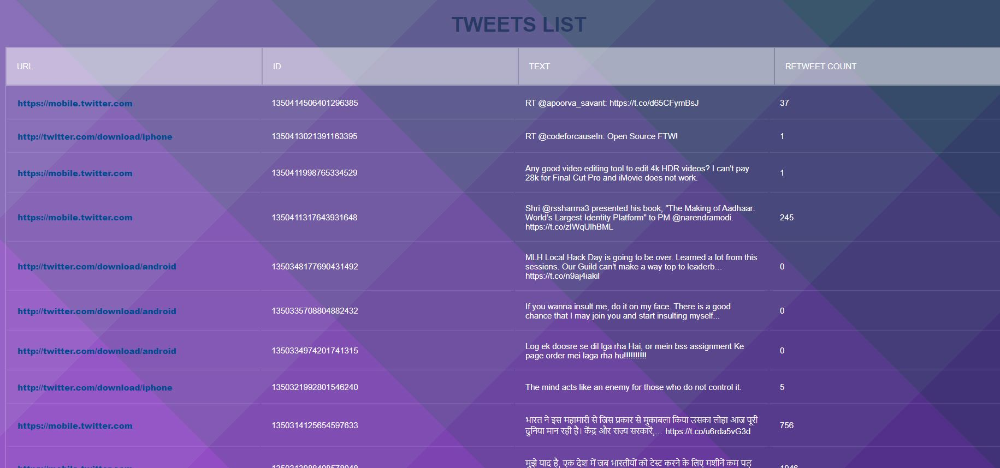

## **FlaskTweepy**
This bot will extract the data from the the twitter and display the whole information like followers, following, likes and retweets.
It displays all the tweets from your timeline.

You can add features like make a tweet or  like a tweets.


**Note** : - <br>Feel free to suggest the changes and make pull requests.

### Topics -> flask, python, tweepy, scraping, webdevelopment, bot, twitter,api
<h5>Preview Link -> <u><a href="https://raw.githubusercontent.com/chaudharypraveen98/FlaskTweepy/master/tweet_list.JPG">FlaskTweepy</a></u></h5>
<h5>Source Code Link -> <u><a href="https://github.com/chaudharypraveen98/FlaskTweepy">GitHub</a></u></h5>

**What We are going to do?**  
<ol>
    <li>Initializing the flask api.</li>
    <li>Getting user info and tweets from Tweepy library</li>
    <li>Rendering on frontend</li>
</ol>

**What is Flask framework?**  

Flask is a micro web framework written in Python. It is classified as a microframework because it does not require particular tools or libraries. It has no database abstraction layer, form validation, or any other components where pre-existing third-party libraries provide common functions.

**How to install required libraries?**
```
pip install tweepy
pip install Flask
```

## Step 1 -> Initializing the flask api
Once Flask and Tweepy are installed then we need to import and intialize the flask app
```
import tweepy
from flask import Flask, render_template

app = Flask(__name__)

```


## Step 2 -> Getting user info and tweets from Tweepy library
First get the twitter api keys from <a href="https://developer.twitter.com/en/docs/twitter-api">Twitter developer account.</a>

Once we got the keys and other credentials, we are ready to go. 

**Variables Initialization**  

**Note : - Please enter your details.**
```
consumer_id = ""
consumer_key = ""
callback_uri = "oob"
ACCESS_TOKEN = ""
ACCESS_TOKEN_SECRET = ""
auth = tweepy.OAuthHandler(consumer_id, consumer_key, callback_uri)
auth.set_access_token(ACCESS_TOKEN, ACCESS_TOKEN_SECRET)
api = tweepy.API(auth)
```
Here we declare the twitter client using OAuthHandler.

**Defining profile route and handler**
```
@app.route('/user/')
def username_tweets():
    me = api.me().screen_name
    return render_template('user.html', user=me)
```

`render_template` takes two argument that takes template name and data to pass to jinja templating engine / frontend 


**Defining tweets route and handler**

It will get the user tweets from the user timeline.

```
@app.route('/tweets/')
def get_tweets():
    my_timeline = api.home_timeline()
    twitter_data = []
    col_header = set()
    allowed_types = [int, str]
    for status in my_timeline:
        status_dict = dict(vars(status))
        status_key = status_dict.keys()
        single_tweet_data = {"user": status.user.screen_name, "author": status.author.screen_name}
        for k in status_key:
            v_type = type(status_dict[k])
            if v_type in allowed_types:
                single_tweet_data[k] = status_dict[k]
                col_header.add(k)
        twitter_data.append(single_tweet_data)
    return render_template('tweets.html', tweets=twitter_data)
```


## Step 3 -> Rendering on frontend  

**Base template**
Every webpage has some common similarities like navbar, footer , and banner. So we have created a base template.

```                           
<!DOCTYPE html>
<html lang="en">
<head>
    <meta charset="UTF-8">
    <title>Home</title>
    <link rel= "stylesheet" type= "text/css" href= "{{ url_for('static',filename='css/home.css') }}">
     }}
</head>
<body>
    
    
</body>
</html>
```

**Tweets template**

```


<link rel="stylesheet" href="{{ url_for('static',filename='css/tweets.css') }}">


<h1>Tweets List</h1>
<div class="tbl-header">
<table class="product">
<thead class="tbl-header">
    <tr>
        <th>URL</th>
        <th>ID</th>
        <th>Text</th>
        <th>Retweet Count</th>
    </tr>
</thead>
</table>

</div>
<div class="tbl-content">
    <table id="product-table-body">
    <tbody>
    
        <tr class="product-row">
            <td>
            <a class="product-title" href="{{ tweet.source_url }}">{{ tweet.source_url }}</a>
            </td>
            <td>{{ tweet.id }}</td>
            <td>{{ tweet.text }}</td>
            <td>{{ tweet.retweet_count }}</td>
        </tr>
    
    </tbody>
    </table>
</div>


```
We have made a table and used a jinja loop to get the data from the tweets queryset.

**User Info Template** 

```



<link rel="stylesheet" href="{{ url_for('static',filename='css/user.css') }}">



<div class="head">
    <h1>Welcome {{ user }}</h1>
    <a> href="{{ url_for('get_tweets') }}" class="btn-hover color-7 next-btn">Click Here To view Tweets</a>
    <h3> Flask Starter Pack modified With Tweepy</h3>
</div>

```

#### **How to run our server** : -
1. First of all, install all the dependencies by `python3 install -r requirements.txt` in the cmd.

2. Then run the following commands to run the server : - <br>
`flask run`

## Deployment
You can easily deploy on <a href="https://www.heroku.com/">Heroku</a>
You can read more about on <a href="https://www.geeksforgeeks.org/deploy-python-flask-app-on-heroku/">GeeksForGeeks Blog</a>

## Web Preview / Output
